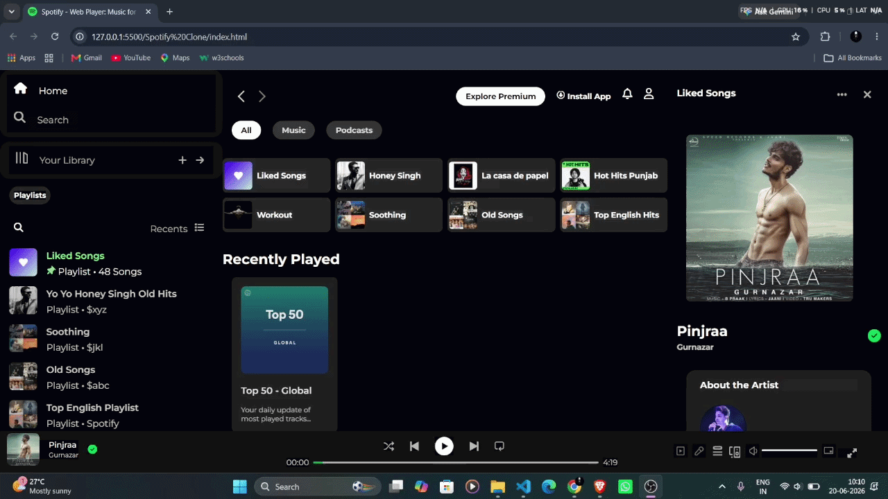
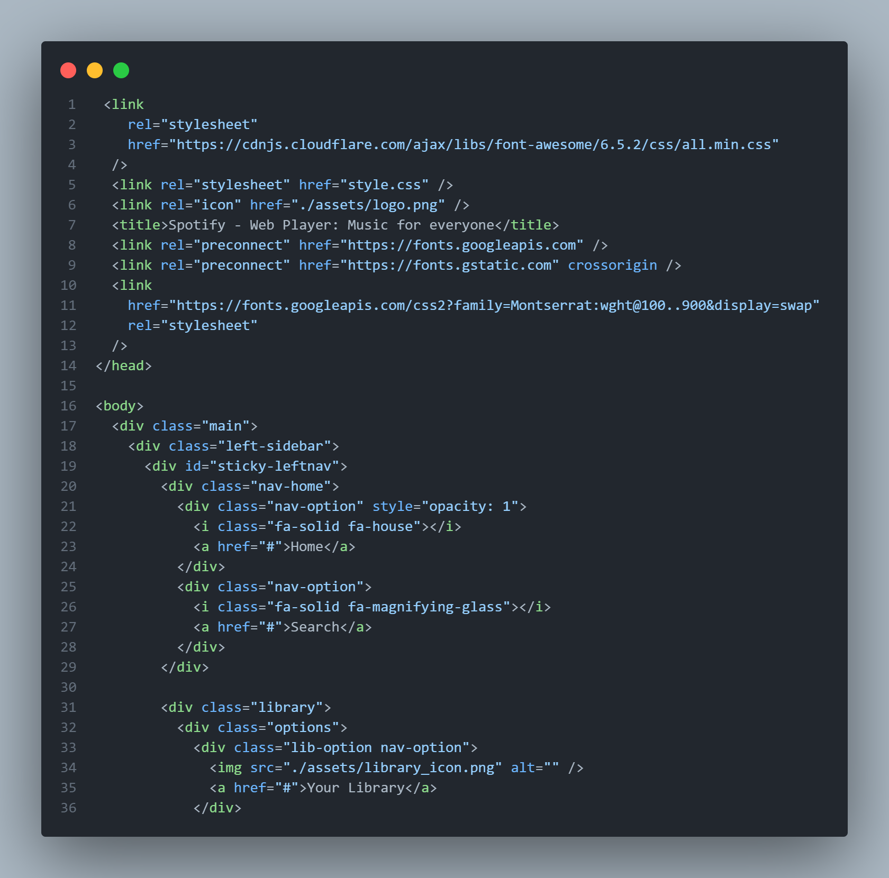

# 🎵 Spotify Clone

A responsive **Spotify Web Player Clone** built using **HTML5** and **CSS3**. This project recreates the look and feel of Spotify's web interface, including the sidebar, navigation bar, playlists, music cards, and player controls.

---

## 📌 Features

- 🎧 Spotify-inspired UI
- 📱 Responsive Layout
- 🎨 Pure HTML & CSS (No JavaScript)
- 📂 Sidebar Navigation
- 🎵 Music Cards
- ❤️ Interactive Hover Effects
- 🎼 Bottom Music Player Design
- 🌙 Dark Theme

---

## 🛠️ Built With

- HTML5
- CSS3
- Font Awesome
- Google Fonts

---

## 📸 Screenshots

### Demo

<p align="center">
  
</p>

### Code Preview

<p align="center">

</p>

---

## 📂 Project Structure

```
Spotify-Clone/
│── assets/
│    │── screenshots
│    └── icons..
│── index.html
│── style.css
└── README.md
```

---

## 💡 What I Learned

- HTML Semantic Elements
- CSS Flexbox
- CSS Grid
- Positioning
- Responsive Design
- Hover Effects
- Icons Integration
- UI Replication

---

## 🎯 Future Improvements

- Add JavaScript functionality
- Music Playback
- Search Feature
- Authentication
- Dark/Light Theme Toggle
- Mobile Navigation Menu

---

## 📄 License

This project is created for educational purposes only.

It is not affiliated with Spotify.

---

## 👨‍💻 Author

**Vaibhav**

GitHub: https://github.com/Vaibhav-Pawar00

LinkedIn: https://www.linkedin.com/in/vaibhav-pawar-77665128a/
