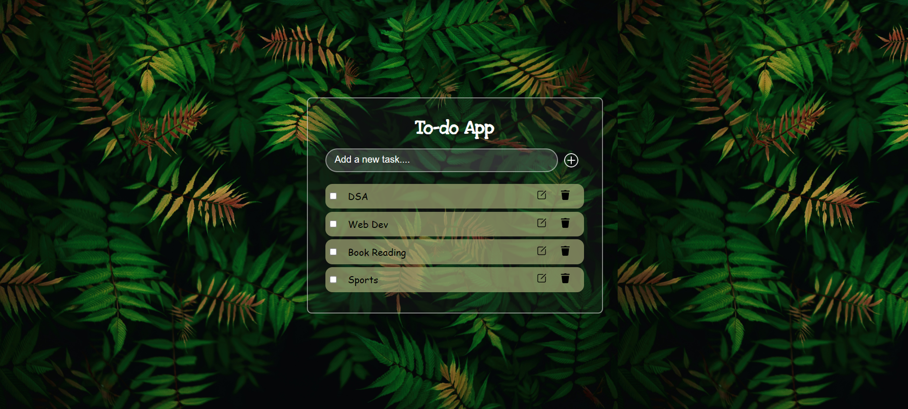
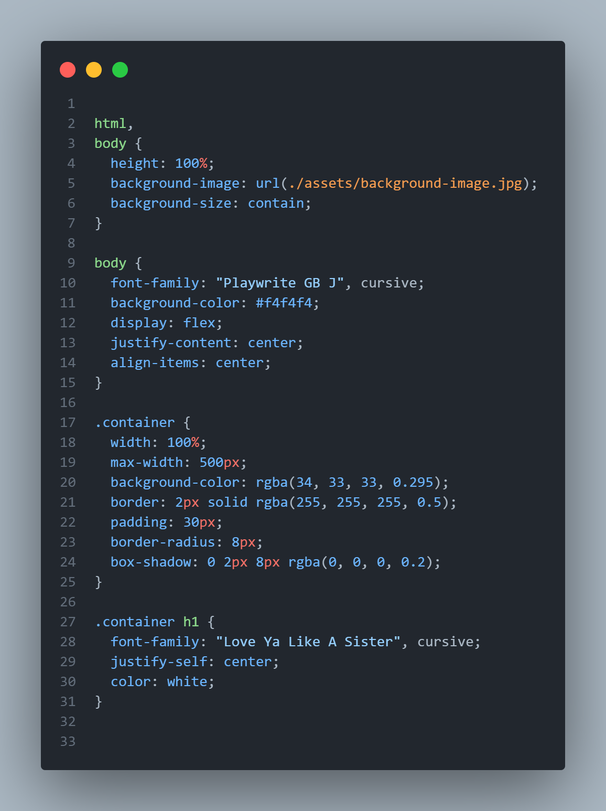
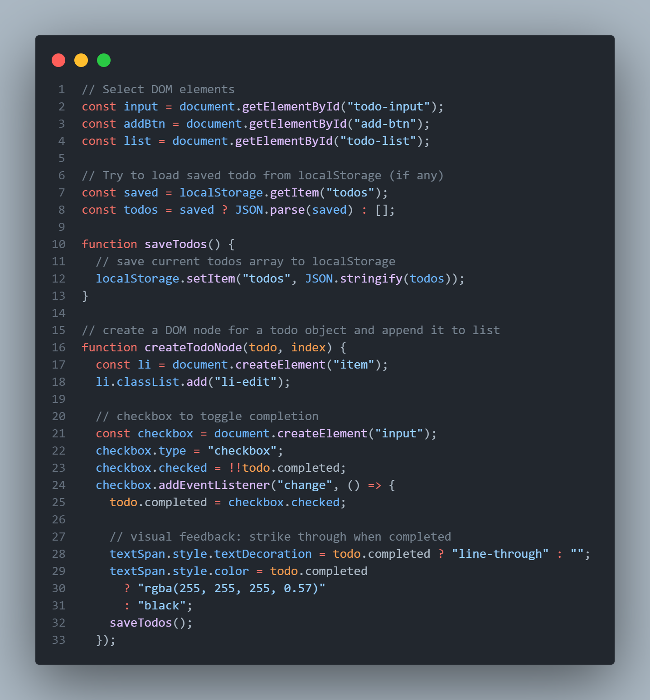

# 📝 ToDo List Web App

A simple and responsive **ToDo List application** built using **HTML, CSS, and JavaScript**. This project helps users manage their daily tasks efficiently by allowing them to add, edit, complete, and delete tasks.

## 🚀 Features

- ➕ Add new tasks
- ✅ Mark tasks as completed (strike-through after completion)
- 📝 Edit existing text
- ❌ Delete tasks
- 📱 Responsive design
- 💾 Stores tasks during the session (in local storage)
- 🎨 Clean and user-friendly interface

## 🛠️ Technologies Used

- **HTML5** – Structure of the application
- **CSS3** – Styling and layout
- **JavaScript** – Functionality and interactivity

## 📂 Project Structure

```
ToDo-List
    │
    ├── assets          # code snippet / Images
    ├── index.html      # Main HTML file
    ├── style.css       # Stylesheet
    ├── script.js       # JavaScript functionality
    └── README.md       # Project documentation
```

## 📸 Screenshots

### Main Page



### CODE SNIPPET

<p align="center" style="display:flex; justify-content:center; gap:20px;">
  
  
</p>

## 🎯 Future Improvements

- Task categories
- Dark mode
- Due dates and reminders
- Drag and drop task re-ordering
